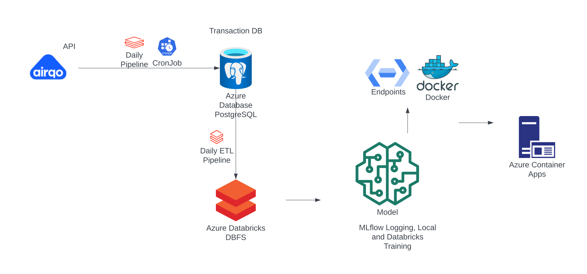
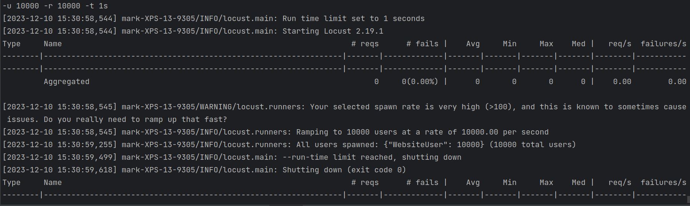
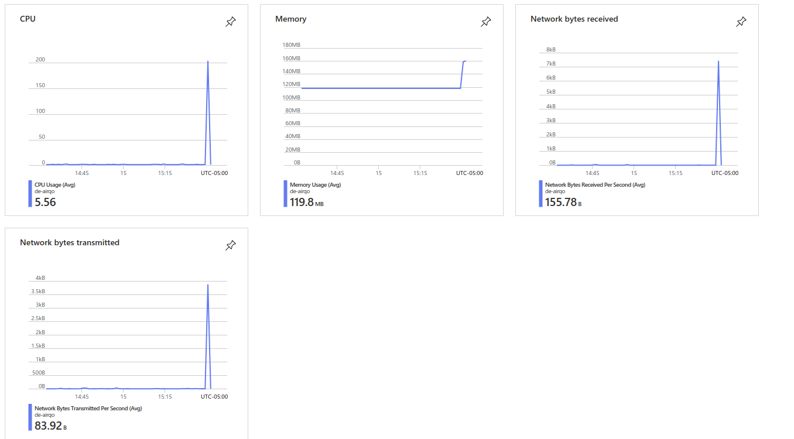

# Data Engineering Final Project 

## About Airqo 
AirQo empowers African communities and Boston Massachusetts USA with accurate, hyperlocal air quality data, fostering timely actions to combat air pollution. Their commitment to providing precise information contributes to creating healthier environments and sustainable communities throughout Africa. Explore their GitHub repository for insights into impactful projects aimed at building a cleaner and healthier future for all.We utilise the API End point to pull the data and build a predictive model 

## Project Architecture

## Data Engineering and ETL 
In the Data Engineering and ETL (Extract, Transform, Load) section, our process began with the initial loading of data from the AirQo API. However, due to the API's limitation of 1000 responses per call, we devised a solution for comprehensive data acquisition.

Initial Load:
API Limitation: The AirQo API provided responses limited to 1000 records per call.

Backfilling with Calendar Module: To overcome this limitation, we implemented a backfilling cron job utilizing the calendar module. This job scrapes daily data for the past three years, ensuring a comprehensive historical dataset.

Ongoing Data Retrieval:
Scheduled Azure Databricks Pipeline: Moving forward, we have established a scheduled Azure Databricks pipeline. This pipeline queries the AirQo API endpoint daily at midnight, ensuring a consistent and up-to-date influx of data.

Data Storage:
Azure PostgreSQL Database: Once obtained, the data is loaded into our transactional Azure PostgreSQL Database, providing a reliable and scalable storage solution.

ETL Process:
Daily Azure Databricks Job: Leveraging Azure Databricks, we execute a daily ETL job. This process transforms the raw data, applying necessary manipulations and enhancements for optimal use in subsequent phases, such as modeling.

Storage in Azure Databricks Blob: The resulting transformed dataset is then stored in Azure Databricks Blob storage. This serves as a staging area for the data before it is further utilized in subsequent phases of our data pipeline.

This comprehensive approach ensures a continuous flow of accurate and enriched data, laying a robust foundation for subsequent analytical and modeling endeavors.

## Microservice 
Model Construction and MLflow Logging:
In the Microservice section, we strategically utilized processed data to craft a classification model, employing advanced techniques to ensure optimal accuracy. The resulting model artifacts underwent meticulous logging using MLflow. This approach not only guarantees traceability but also facilitates reproducibility throughout the machine learning lifecycle.

Seamless Model Deployment:
MLflow Integration:
Our model artifacts seamlessly integrated with MLflow, leveraging its robust capabilities for managing the entire machine learning lifecycle. This integration provides a structured and centralized environment for tracking, versioning, and organizing the classification model.

FastAPI Microservice:
The classification model found its home within a FastAPI microservice, where it was encapsulated into distinct endpoints. This microservice functions as a scalable and efficient interface, enabling seamless predictions and interactions with the underlying model.

Containerization and Packaging for Deployment Flexibility:
Azure Container Registry (ACR):
To enhance deployment flexibility and scalability, both the classification models and FastAPI microservices were containerized and packaged using Azure Container Registry (ACR). ACR facilitates straightforward management and deployment within the Azure ecosystem.

DockerHub with GitHub Actions:
For broader accessibility and compatibility, our models and microservices were also packaged using DockerHub. GitHub Actions played a crucial role in automating the containerization process, ensuring a streamlined and efficient deployment workflow. This dual approach provides flexibility in deployment options while maintaining accessibility and ease of integration.

## Load test
Our application successfully withstood the load of 10,000 requests per second during rigorous testing with Locust, showcasing its robustness and scalability. With zero failures observed, this outcome instills confidence in the application's reliability under high-demand scenarios. Continuous monitoring will be a priority to uphold optimal performance as we move forward.

We also observed the cluster compute resource utilization during the load test as shown below

## Infrastructure As Code 
we opted for Azure Container App as our preferred platform for deploying the application. This choice was driven by several factors, including the simplicity and flexibility offered by Azure Container App in managing containerized applications. Leveraging Azure Container App's declarative approach to IaC allowed us to define and configure the entire deployment infrastructure in code, ensuring consistency and reproducibility. Additionally, Azure Container App seamlessly integrates with other Azure services, providing a cohesive environment for our application. This strategic use of IaC streamlines deployment processes, enhances scalability, and aligns with best practices for managing and maintaining our application's infrastructure.

## Utlisation Of AI Tool
Copilot was my prefered tool of choice for autocompletion and code suggestions on my Pycharm IDE. 

